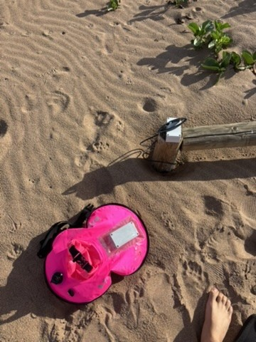
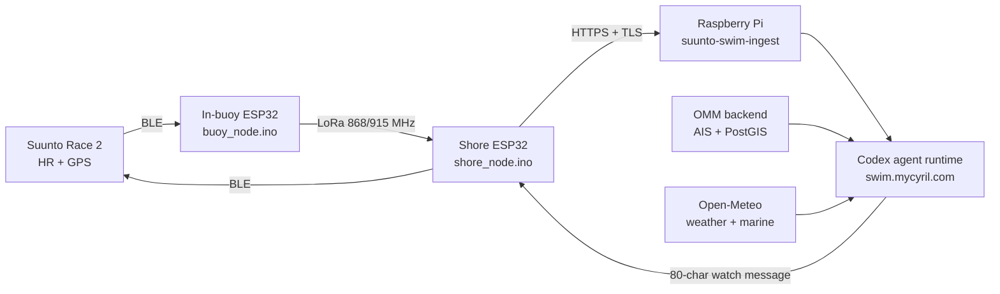

# Ocean Mince Meter

Open-water swim safety system for solo sea swims. It answers one question the
whole way down: **how dangerous is this water, right now, for this swimmer**,
from currents and weather to the ships transiting the swim line.



Three components, three repos:

| Component | What it does | Repo |
|---|---|---|
| **Swim buoy** | Suunto Race 2 watch → BLE → in-buoy ESP32 → LoRa radio → shore-side ESP32 → Wi-Fi uplink. Custom 20-byte telemetry packet keeps HR + GPS intact across all four hops. | [suunto-swim-buoy](https://github.com/georgepullen/suunto-swim-buoy) (private) |
| **Codex runtime** | Raspberry Pi ingest service + agent loop. Live swim frames wake the Codex agent (throttled to ≤1 run/min); it fuses GPS track, HR trend, Open-Meteo weather/marine, AIS vessel context and swim history into watch-facing messages capped at 80 ASCII chars with colour/header markup. | [suunto-codex-loop](https://github.com/georgepullen/suunto-codex-loop) (private) |
| **Risk backend** (this repo) | Live AIS ship traffic: Next.js map with live vessel dots, `aisstream` capture pipeline, Supabase/PostGIS storage. | this repo |

## Architecture



## Implementation notes

- **Wearable protocol, reverse engineered.** The Suunto Race 2 companion BLE
  protocol is undocumented. The watch-side link, the telemetry packet, a
  read-only SDK and an MCP server were built from protocol research in
  `suunto/reverse-engineering` and stabilized in `suunto/sdk`.
- **Hard output and wake budgets.** The agent runs under an 80 ASCII char
  limit with up to 3 messages per shore response, at most one wake per
  minute, and stays silent on stale frames. A briefing/heartbeat policy
  separates sea swims from pool and inland test sessions before it speaks.
- **End-to-end data integrity.** HR and GPS survive watch → MCU → radio →
  radio → HTTP → agent. The shore node persists endpoint, token and TLS mode
  in NVS and validates TLS certificates rather than trusting the LAN.
- **Deterministic replay.** `codex-loop/bin/replay-swim` feeds a recorded
  GPS/HR route back through the real runtime (same ingest, same agent, same
  delivery path) to regenerate the watch messages a swim would have
  produced. Used for debriefs and demos.
- **Live ship traffic.** The backend ingests `aisstream` into PostGIS and
  serves time-windowed vessel positions to the map; the same AIS context is
  available to the runtime as swim-time vessel risk.

## Field status

First end-to-end field test completed at Point Samson, Western Australia
(June 2026): watch → buoy → LoRa → shore → Pi → live codex analysis, with
the watch displaying runtime messages mid-swim. See [demo/](demo/) for the
site, the recovered GPS route, and the replay transcript that regenerates
the runtime's watch messages from the real track.

## Local development (backend)

Start Supabase:

```bash
supabase start
supabase db reset
```

Run the app:

```bash
pnpm dev
```

Core endpoints:

- `GET /api/ais-latest`
- `GET /api/tiles?z&x&y&time&rawWindowMinutes`

### Layout

- `apps/web`: Next.js app (map UI + API routes)
- `packages/db`: shared Supabase config helpers (`@ocean/db`)
- `services/pipeline`: AIS capture + raw-point ingest scripts
- `supabase`: Supabase config + migrations
