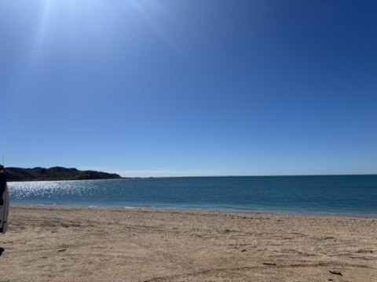
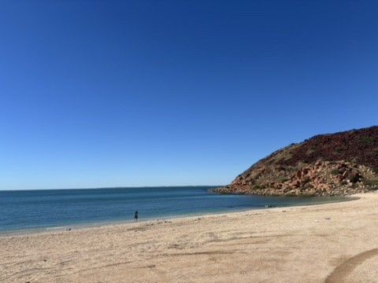
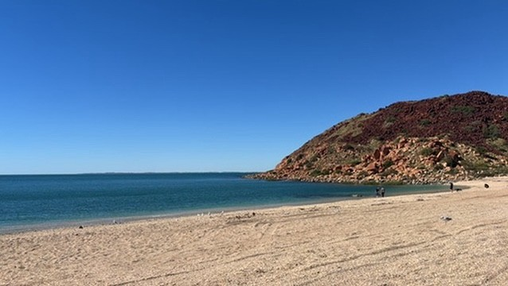
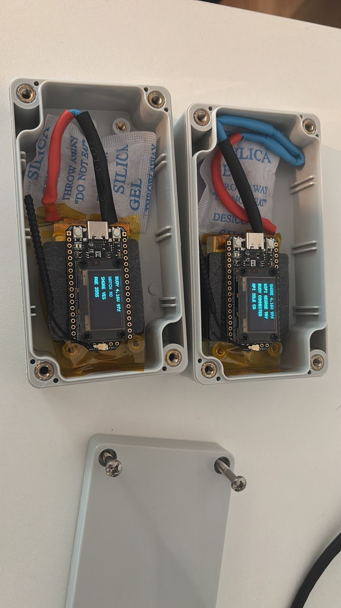
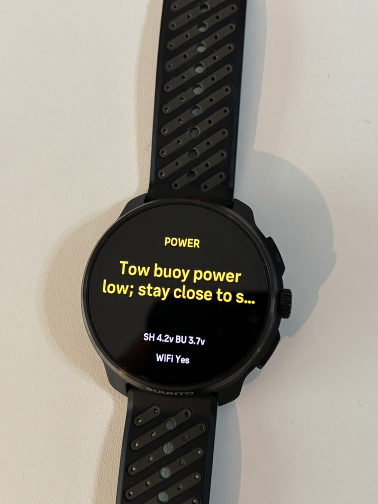

# First field test: Point Samson, Western Australia (June 2026)

End-to-end system test of the Ocean Mince Meter swim-buoy pipeline:
Suunto Race 2 → in-buoy ESP32 → LoRa → shore-side ESP32 → Raspberry Pi
ingest → Codex agent runtime → watch-facing messages.

## What happened

- **2026-06-15/16 (AWST)**: hardware staged at Point Samson
  (`media/buoy-on-sand.jpg`, pink buoy shell with the buoy-node electronics),
  shore station run from the back of the 4WD with laptop + ingest service.
- **2026-06-16 ~14:00 AWST**: first live swim with the full loop active. The
  route below is that swim, as shown by the Suunto app
  (`media/suunto-route-screenshot.jpg`, ~867 m loop in Honeymoon Cove bay).
- Activity data for this swim lives on a different Suunto account, so the
  watch-side FIT export isn't available; the route was recovered from the app
  map instead (method below).

## Live replay transcript

`transcript.md` / `transcript.json` are produced by
`codex-loop/bin/replay-swim` ([suunto-codex-loop](https://github.com/georgepullen/suunto-codex-loop)),
which feeds the route back through the **real runtime** (same ingest
service, same wake throttling, same prompt and delivery path), so the
messages are 1:1 with what the watch would have shown, modulo ocean
conditions (the runtime fetches live weather/marine at replay time, not
conditions from the day).

## Route recovery method

1. The Suunto app map screenshot (359×780) was contrast-stretched to isolate
   the faint track ribbon over the water
   (`media/route-digitized-overlay.png`, recovered polyline drawn in red).
2. The map was georeferenced from its own scale bar (0.5 mi / 176 px →
   4.572 m/px) anchored on the OSM Honeymoon Cove beach centroid; the OSM
   coastline re-projected through the same transform hugs the photographed
   shoreline at the swim site, bounding residual error at well under 100 m.
3. The polyline was smoothed and resampled at a 2:00/100 m pace → 81 points,
   867 m, ~17 min. HR is an illustrative open-water profile (the original
   per-second HR is on the other account).

| | |
|---|---|
|  |  |
|  |  |
|  |  |

*Top/bottom left: the swim buoy staged on the sand. Right: Honeymoon Cove bay,
Point Samson WA — swim area in `media/suunto-route-screenshot.jpg`. Bottom
row: the two LoRa ESP32 nodes link-testing in May 2026 (buoy and shore OLEDs
showing pack voltages and RSSI), and the Suunto Race 2 on-screen during live
testing: a yellow `POWER` alert, `Tow buoy power low; stay close to shore…`,
with shore and buoy pack voltages live.*
